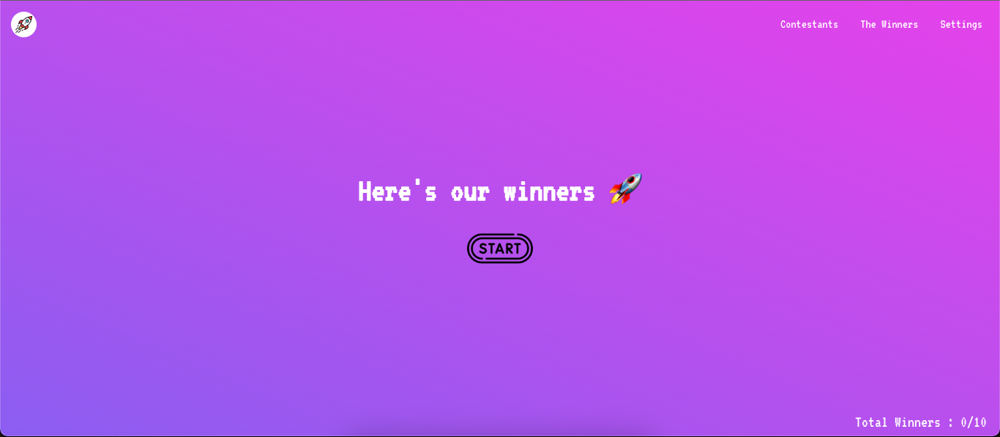
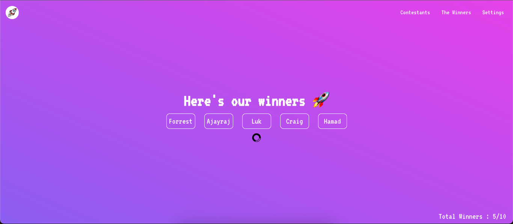
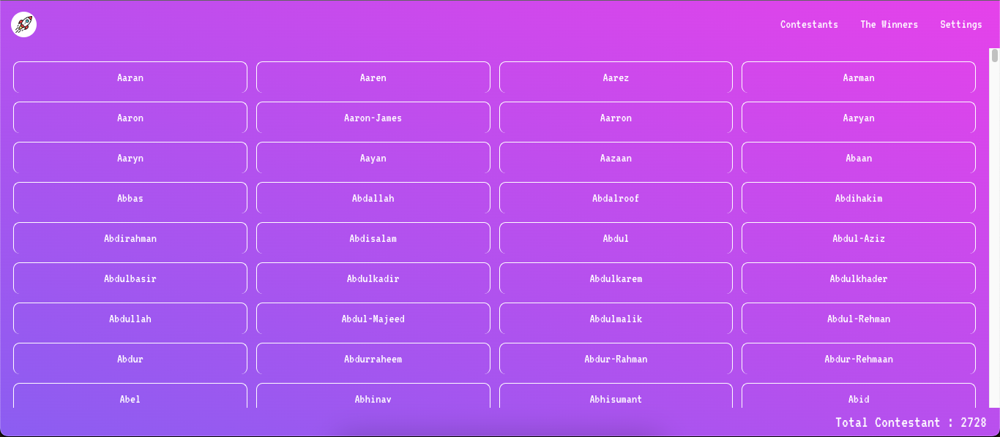
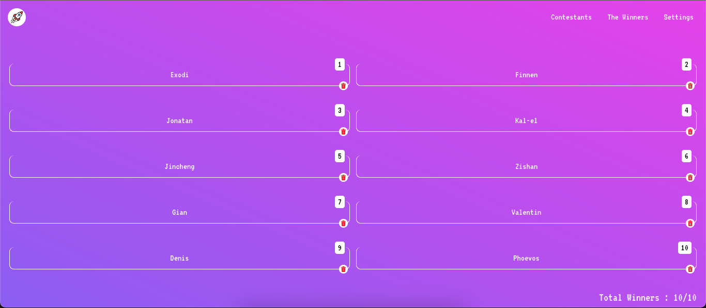
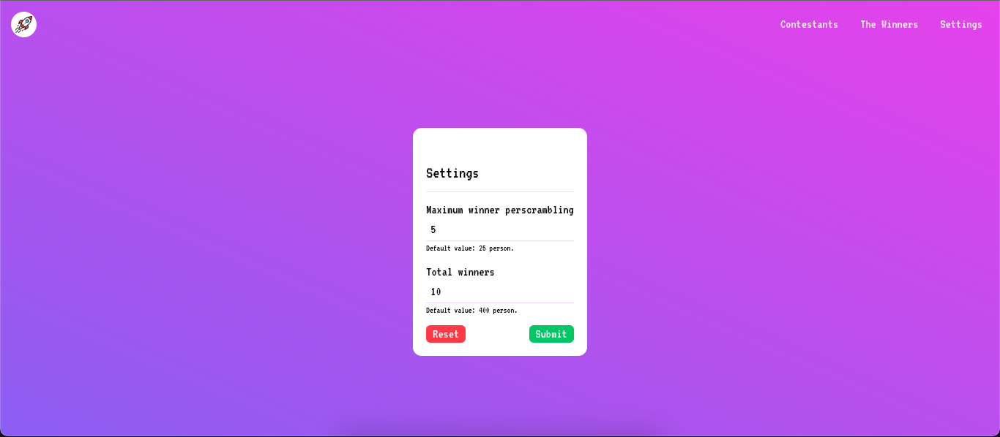

# Giveaway App 🚀

The Giveaway app is an application for scrambling data (users) using the Math function on javascript.
This app will be scrambling 100 times until set the winner.
The maximum number of the winner is static at 6.

#### Home Screen

#### Contestant Screen

#### The Winners Screen

#### Settings Screen

Demo: https://react-giveaway.vercel.app

## Usage

Just clone the repository and run following commands :

- `npm install`
- `npm run start`
- Open on your favorite browser at `http://localhost:3000`
- Enjoy! 🤓

### Updates

#### #15 Apr 2023

- Refactor Scrumble Function
- Update background color
- Update maximum person will be winner in 1 scrambling
- Update maximum person will scrambling in home screen
- Add Setting screen

#### #17 Apr 2023
- Update Setting Screen
- Refactor Layout & Theme
- Add LocalStorage
- Remove the Winner (on progress)

If you have idea to put some features, feel free to send PR.
Thank you!

---

Made with ♥️
